# 🚀 İstanbul Trafik Alerter — Uygulama Planı Genel Bakış

> Bu plan, her biri bağımsız olarak daha az kapasiteli bir yapay zekaya delege edilebilecek küçük görevlerden oluşmaktadır. Her görev açık giriş/çıkış tanımına sahiptir.

## Fazlar

| Faz | Başlık | Görev Sayısı | Dosya |
|-----|--------|-------------|-------|
| 0 | [Proje Altyapısı & DevOps Temelleri](./faz_0_altyapi.md) | 4 | `faz_0_altyapi.md` |
| 1 | [Veritabanı Modelleri & CRUD](./faz_1_veritabani.md) | 5 | `faz_1_veritabani.md` |
| 2 | [Dış API Entegrasyonları](./faz_2_api_entegrasyonlari.md) | 5 | `faz_2_api_entegrasyonlari.md` |
| 3 | [Tahmin Motoru](./faz_3_tahmin_motoru.md) | 4 | `faz_3_tahmin_motoru.md` |
| 4 | [API Katmanı & Auth](./faz_4_api_katmani.md) | 4 | `faz_4_api_katmani.md` |
| 5 | [Flutter Mobil Uygulama](./faz_5_flutter_mobil.md) | 7 | `faz_5_flutter_mobil.md` |
| 6 | [Test & Deploy](./faz_6_test_deploy.md) | 3 | `faz_6_test_deploy.md` |

## Bağımlılık Matrisi

```mermaid
graph TD
    F0[Faz 0: Altyapı] --> F1[Faz 1: DB Modelleri]
    F0 --> F2[Faz 2: API Entegrasyonları]
    F1 --> F3[Faz 3: Tahmin Motoru]
    F2 --> F3
    F1 --> F4[Faz 4: API & Auth]
    F3 --> F4
    F4 --> F5[Faz 5: Flutter Mobil]
    F4 --> F6[Faz 6: Test & Deploy]
    F5 --> F6
```

> [!TIP]
> **Paralel çalışma:** Faz 1 ve Faz 2 birbirinden bağımsızdır, paralel olarak farklı AI'lara delege edilebilir. Faz 5 (Flutter) de backend API kontratları belirlendikten sonra mock data ile paralel geliştirilebilir.
